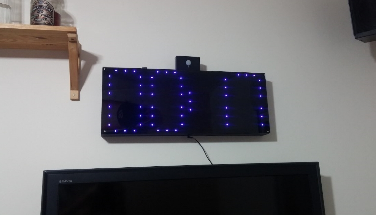
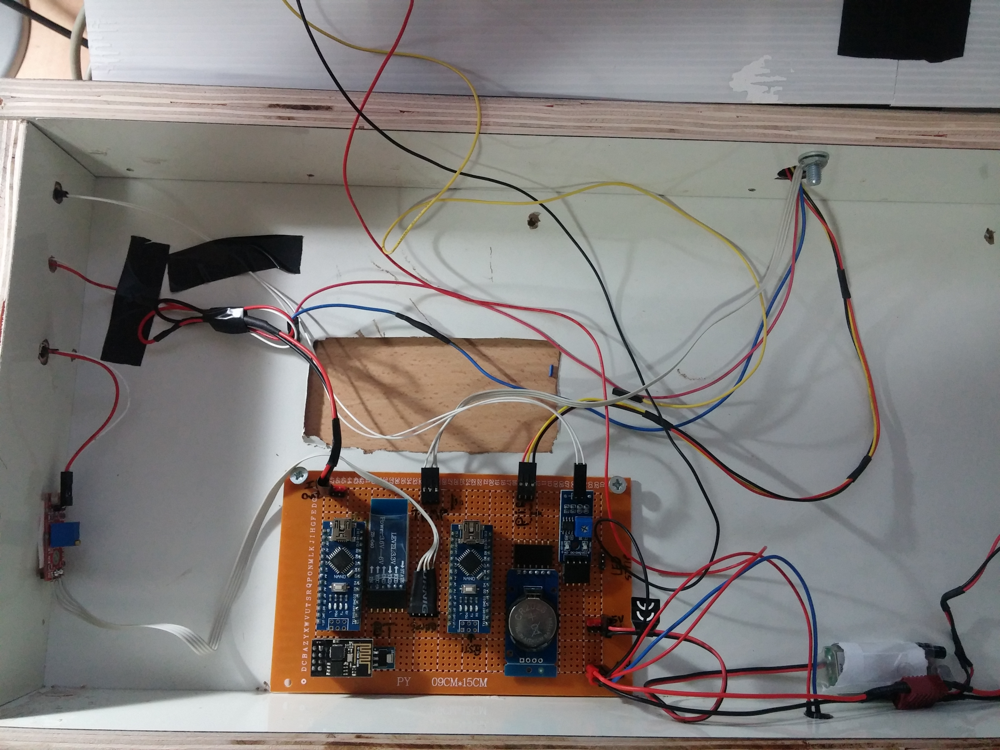
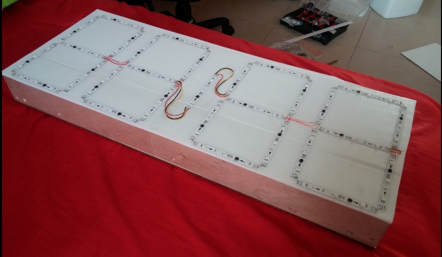

#Smart room remote control app

Control my DIY smart room system (based on Arduino nano, ESP8266, Ir blaster and a lot of sensors) using MQTT protocol.
the commands are fast and lightweight thanks to the MQTT protocol.
* links to the arduino + ESP8266 codes will be added here later.

## Smart room system \ Smart clock
  

## Android Application

## Features
* Remote control Electric devices that are support infra-red remote, and get information about the room (like temperature of the room).
* The app buttons and their actions are dynamically created from a json file to adapt for each user and his devices. 
* The JSON file represent an array of devices and each device contains an array of Commands (learned infra-red signal).
* User friendly interface.  

## System Components
* The main components are: Arduino Nano, ESP8266, RTC module, Bluetooth,light sensore, PIR sensor, infra-red diode and sound sensor.

## The 7 Segment - behind the scenes (:
* Digital led strip, model WS2812b, cutted and soldered again at each 3 leds. 
* The digits are 'created' by turning on the right 'pixels' (pixel mean each 3 leds).

